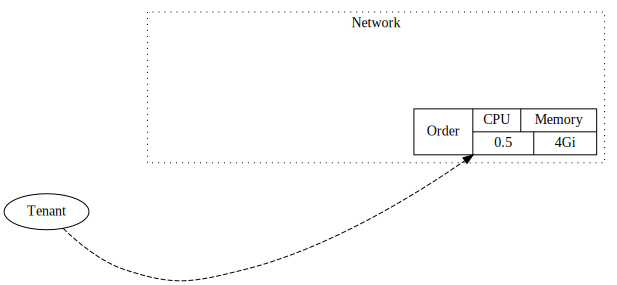
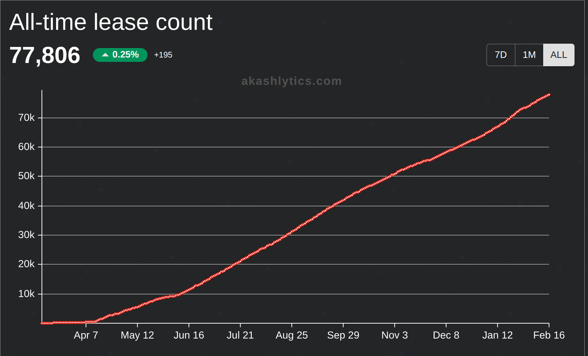
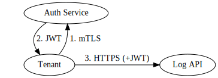

## Past, Present, and Future

---

## DevOps: The Company Killer

* Everyone wants global deployments.
* Not everyone should should roll their own.
* DevOps is a huge distraction for companies trying to build actual products.

---

## What if Heroku, but also Edge?

* CDNs have been distributing assets globally for years.
* Docker images look and smell like static assets.
* "Dynamic Delivery Network" - **how hard could it be?**

---

## Platform: vCentralized

* :white_check_mark:Flexible hosting: Cloud, On-Prem, Colo.
* :white_check_mark: "Push to Deploy", logging, billing, etc.
* :x: **Sign on thousands of hosting providers.**
* :thinking: On second thought, what if it's a marketplace...
* :sunglasses: ... _Yeah, that's the ticket._

---

## Marketplace: vDEX

- Trustless (pros and cons).
- Transparent pricing (with history).
- Simple payments (in principle).
- **UNSTOPPABLE**.

---

> **_The revolution will not be centralized!_**

---

## The Akash Cloud

- **The Network**: marketplace, payments.
- **The Platform**: hosting, management.

---
## The Network
Resource Acquisition

---
## The Network
Resource Acquisition

---
## The Network
Resource Acquisition

---

## The Platform
Workload Distribution

---

## The Platform
Workload Distribution

---

## Eight Months In

---

## Awesome-Akash

Community-sourced deployment examples

---

## Awesome-Akash

- 80+ applications
- Databases, games, blogging platforms, crypto wallets, etc...

---

## Mining: pkt.cash

---

## Cosmos-Omnibus

Generic SDK node hosting infrastructure.

- Publish docker images.
- Multiple bootstrap options:
  - snapshot
  - state-sync
- **New: publish daily snapshots.**

---

## Cosmos-Omnibus

---

## Coming Soon

- Free trials (Authz)
- JWT Authentication
- Cosmos-omnibus: relayer fleet
- Cosmos-omnibus: state-sync fleet
- Auditor network
- More resources: IP address, GPU, storage, etc...
- New CLI

---

## JWT Authentication

Bootstrap traditional authentication from on-chain mTLS certs.

---

## Challenges

* Query performance.
* Reliable event stream.
* Database performance.
* Database size.
* Reliable state-sync.

---

## Questions
